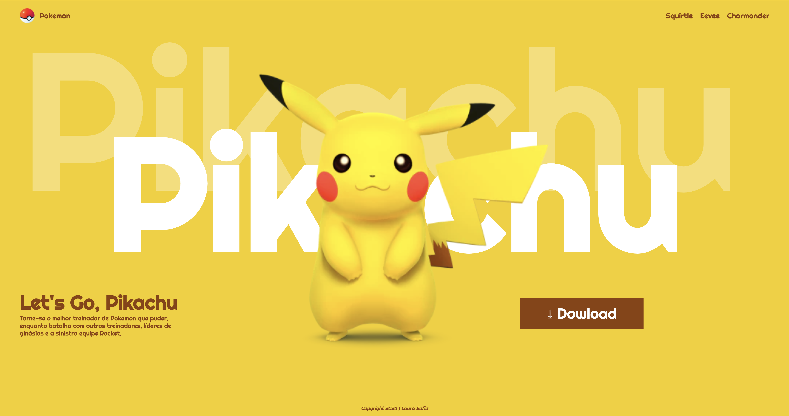

# Pikachu-2024

---
## Sobre
site do tipo lading page para divulgar o jogo Let's Go, Pikachu.
O intuito deste projeto é colocar em prática o conhecimento adquirido sobre as linguagens de marcação, HTML, CSS e Markdown, no curso Técnico de Desenvolvimento de Sistemas do [SENAI JANDIRA](https://sp.senai.br/unidade/jandira/).

---
## Tecnologias ultilizadas
- HTML
- CSS
- Markdown
- Git

---
# Autor
- [Laura Sofia](https://github.com/LauraSofiasil)